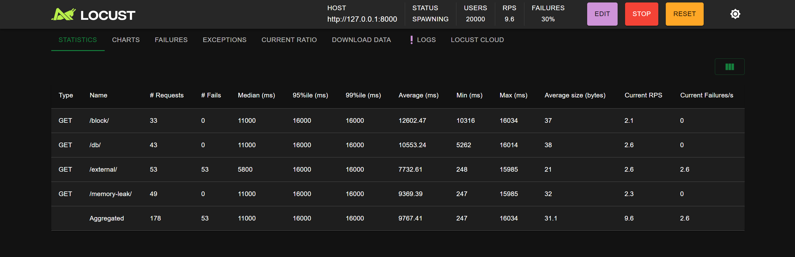

# Monolith Stress Test

## Overview

This project demonstrates common bottlenecks in monolithic applications using FastAPI and Locust, helping developers understand and mitigate performance issues.

## Features

- **Blocking Task:** Simulates long-running operations.
- **External API Call:** Demonstrates third-party dependency risks.
- **Slow DB Query:** Highlights the need for indexing and caching.
- **Failure Simulation:** Triggers an intentional crash.
- **Memory Leak:** Shows impact of poor memory management.

## Setup & Execution

1. Install dependencies:
   ```sh
   pip install fastapi uvicorn locust requests
   ```
2. Run the FastAPI app:
   ```sh
   uvicorn main:app --host 0.0.0.0 --port 8000 --workers 1
   ```
3. Start load testing with Locust:
   ```sh
   locust -f locust.py --host=http://127.0.0.1:8000
   ```

## API Endpoints

| Endpoint        | Description                 |
| --------------- | --------------------------- |
| `/block/`       | Simulates a blocking task.  |
| `/external/`    | Calls an external API.      |
| `/db/`          | Simulates a slow DB query.  |
| `/crash/`       | Forcefully crashes the app. |
| `/memory-leak/` | Simulates memory leak.      |

## Observing Failures

- Use Locust UI to track response times and failures.
- Increase users gradually to find system limits.
- Monitor memory consumption during `/memory-leak/` tests.



